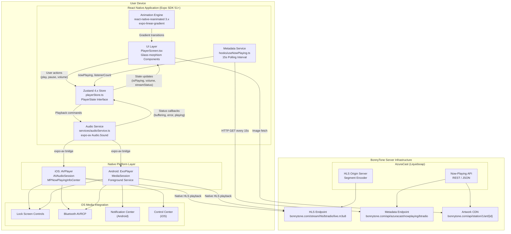
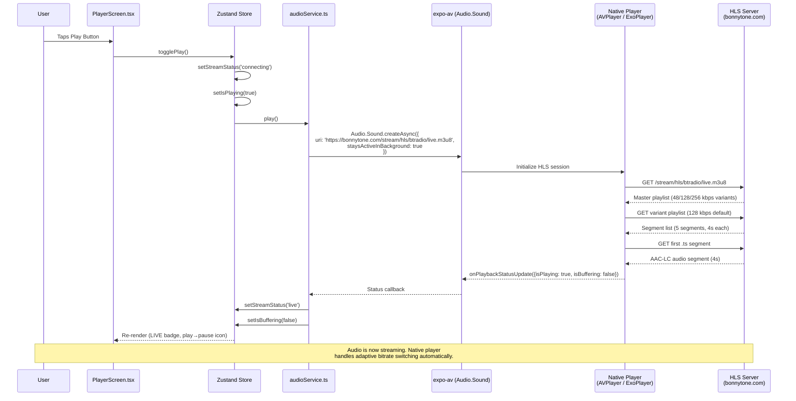
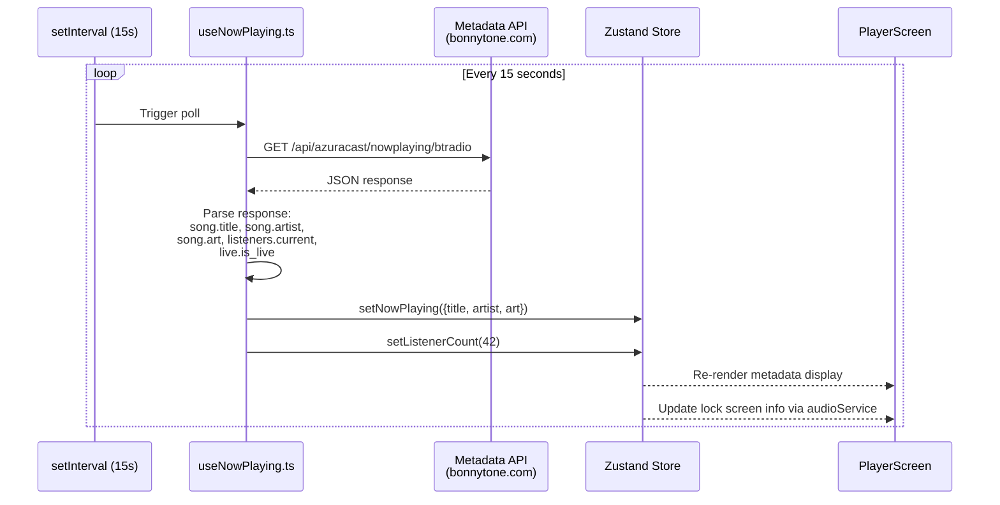
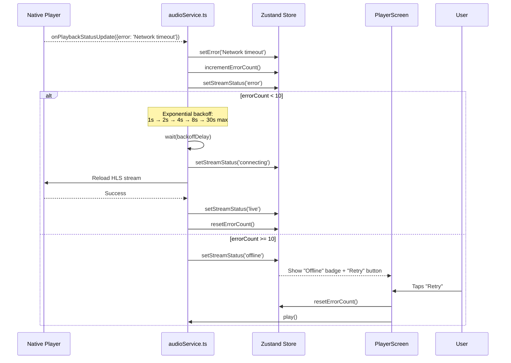
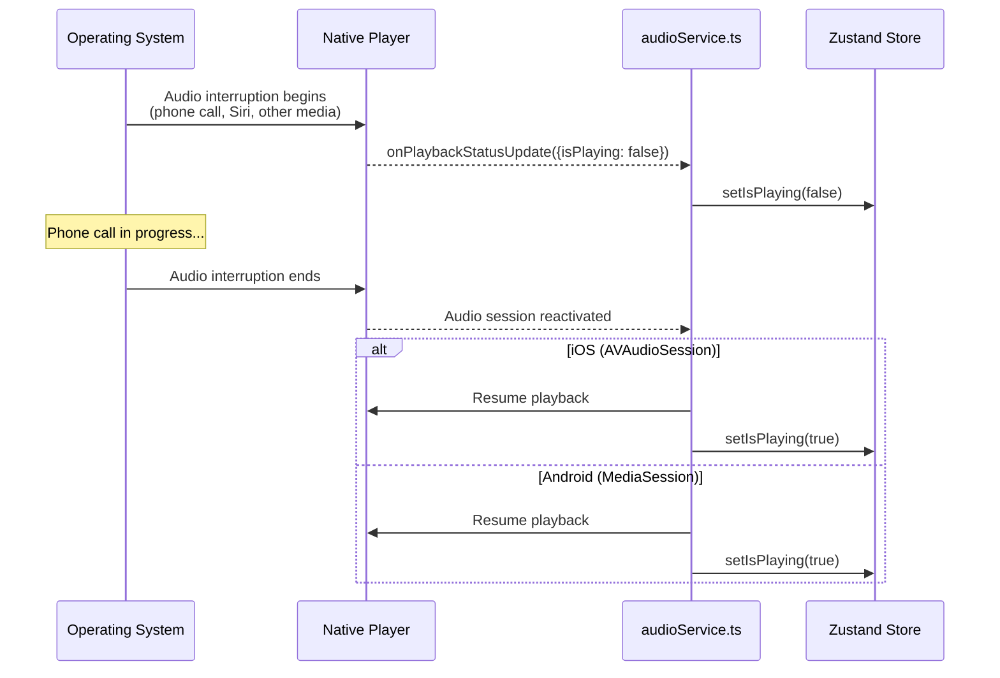
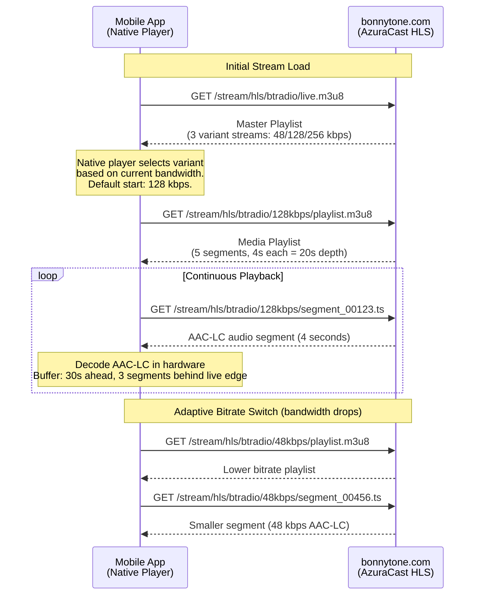
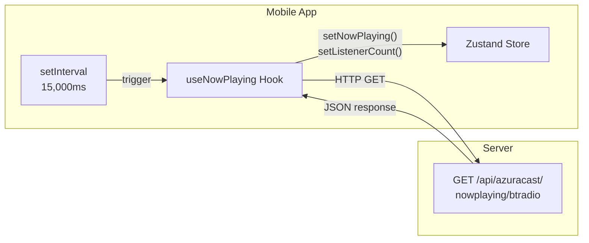
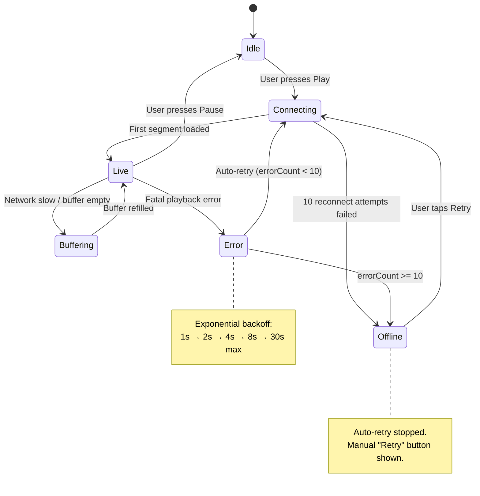
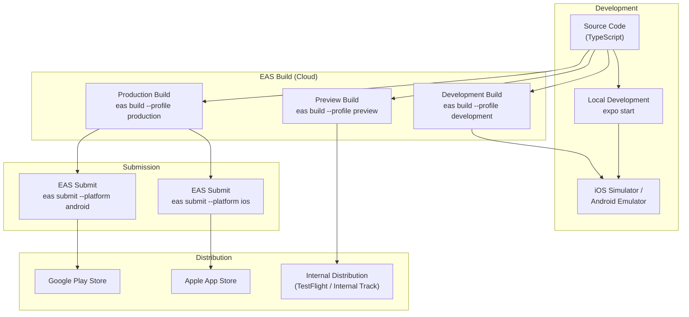

# BonnyTone Radio — System Architecture

> Architecture documentation for the BonnyTone Radio mobile application.
> This document guides the Mobile Developer Agent through the system design, technology choices, platform considerations, and deployment pipeline.

**Spec Reference:** `bonnytone-mobile-agents-spec-UPDATED.md` (v2.0)

---

## Table of Contents

1. [System Architecture Diagram](#1-system-architecture-diagram)
2. [Component Interaction Flow](#2-component-interaction-flow)
3. [Technology Stack Overview](#3-technology-stack-overview)
4. [Mobile Platform Considerations](#4-mobile-platform-considerations)
5. [Network Architecture](#5-network-architecture)
6. [Deployment Architecture](#6-deployment-architecture)
7. [Reference Spec Sections](#7-reference-spec-sections)

---

## 1. System Architecture Diagram

The following diagram shows the full system from the user's device through the React Native layer down to the streaming server infrastructure.



### Layer Responsibilities

| Layer | Responsibility |
|-------|---------------|
| **UI Layer** | Renders player screen, handles touch events, displays metadata and status |
| **State Layer (Zustand)** | Single source of truth for playback state, metadata, errors, volume |
| **Audio Service** | Manages `expo-av` Audio.Sound instance, handles play/pause/resume lifecycle |
| **Metadata Service** | Polls now-playing API every 15 seconds, updates store with artist/title/art |
| **Native Platform Layer** | OS-level audio playback (HLS decoding), media session registration |
| **OS Media Integration** | Lock screen controls, Bluetooth routing, notification controls |
| **Server Infrastructure** | AzuraCast streaming server with HLS output and metadata REST API |

---

## 2. Component Interaction Flow

### 2.1 Primary Playback Flow



### 2.2 Metadata Polling Flow



### 2.3 Error Recovery Flow



### 2.4 Audio Interruption Flow



---

## 3. Technology Stack Overview

### 3.1 Core Dependencies

| Category | Technology | Version | Justification |
|----------|-----------|---------|---------------|
| **Framework** | React Native + Expo | SDK 51+ (`~51.0.0`) | Managed workflow reduces native config overhead. Expo SDK 51 supports iOS 16+ and Android 6+, covering 95%+ of active devices. Single codebase for both platforms. |
| **Language** | TypeScript | 5.x (strict mode) | Type safety for the Zustand store interface, audio service callbacks, and API response parsing. Catches state-related bugs at compile time. |
| **Audio Engine** | expo-av | `~14.0.0` | Provides `Audio.Sound` API with `staysActiveInBackground: true`. Bridges to AVPlayer (iOS) and ExoPlayer (Android) for native HLS decoding -- no JavaScript-side HLS parsing needed. Supports lock screen controls and Bluetooth routing out of the box. |
| **HLS Playback** | Native (AVPlayer / ExoPlayer) | Built-in | Both native players support HLS with adaptive bitrate switching. No `hls.js` required on mobile (unlike web). AAC-LC codec decoded in hardware. |
| **State Management** | Zustand | `^4.5.0` | Lightweight (1.1 KB gzipped), no Provider wrapper needed, works outside React components (audio service can read/write store directly). Supports middleware for persistence (AsyncStorage). |
| **Navigation** | expo-router | `~3.5.0` | File-based routing aligned with Expo conventions. Single-screen app uses minimal routing, but expo-router provides deep linking and future multi-screen support. |
| **Animations** | react-native-reanimated | `~3.10.0` | Runs animations on the UI thread (not JS thread) for 60fps gradient transitions. Required for smooth glass-morphism effects and play button pulse animation. |
| **Background Gradient** | expo-linear-gradient | `~13.0.0` | Native linear gradient rendering. Combined with reanimated for slow color transitions (Option A animated background per spec section 7.3). |
| **Share** | React Native `Share` API | Built-in | Native share sheet on both platforms. No additional dependency needed. `expo-sharing` available as fallback for file sharing in future versions. |

### 3.2 Rejected Alternatives

| Alternative | Reason for Rejection | Spec Reference |
|-------------|---------------------|----------------|
| `react-native-track-player` | Requires bare React Native workflow or custom Expo dev client. Additional native configuration complexity. `expo-av` is sufficient for a single-stream radio app. | Spec Section 5 |
| `hls.js` (JavaScript HLS) | Unnecessary on mobile. iOS AVPlayer and Android ExoPlayer decode HLS natively with hardware acceleration. Adding hls.js would increase bundle size and CPU usage with no benefit. | Spec Section 5 |
| Redux / Redux Toolkit | Over-engineered for a single-screen player app. Zustand provides the same global state with 90% less boilerplate and no Provider component. | Spec Section 6 |
| React Navigation | expo-router is the Expo-recommended solution and provides file-based routing. React Navigation would require manual route configuration. | Spec Section 5 |

### 3.3 Dev & Build Dependencies

| Category | Technology | Purpose |
|----------|-----------|---------|
| **Build System** | EAS Build | Cloud builds for iOS (requires Apple Developer account) and Android. No local Xcode/Gradle setup needed. |
| **Submission** | EAS Submit | Automated submission to App Store Connect and Google Play Console. |
| **Unit Testing** | Jest + React Native Testing Library | Test Zustand store actions, audio service logic, component rendering. |
| **E2E Testing** | Detox (or manual) | Device-level testing for background audio, lock screen, Bluetooth. Deferred to manual testing if Detox setup is too complex for v1.0. |
| **Type Checking** | TypeScript `strict: true` | Enforced via `tsconfig.json`. All store interfaces, API responses, and service functions must be fully typed. |
| **Linting** | ESLint | Standard Expo ESLint config. |

### 3.4 Dependency Manifest

```json
{
  "dependencies": {
    "expo": "~51.0.0",
    "expo-av": "~14.0.0",
    "expo-router": "~3.5.0",
    "expo-linear-gradient": "~13.0.0",
    "expo-sharing": "~12.0.0",
    "react-native-reanimated": "~3.10.0",
    "zustand": "^4.5.0"
  },
  "devDependencies": {
    "@types/react": "~18.2.0",
    "typescript": "~5.3.0",
    "jest": "~29.7.0",
    "@testing-library/react-native": "~12.4.0"
  }
}
```

---

## 4. Mobile Platform Considerations

### 4.1 iOS Audio Session

iOS requires explicit audio session configuration for background playback and proper interaction with other audio sources.

**Configuration:**

```typescript
import { Audio, InterruptionModeIOS } from 'expo-av'

await Audio.setAudioModeAsync({
  staysActiveInBackground: true,                    // CRITICAL: enables background playback
  interruptionModeIOS: InterruptionModeIOS.DuckOthers,  // Lower other audio instead of stopping
  playsInSilentModeIOS: true,                       // Play even when silent switch is on
  shouldDuckAndroid: true,
})
```

**Required `app.json` configuration (iOS):**

```json
{
  "expo": {
    "ios": {
      "infoPlist": {
        "UIBackgroundModes": ["audio"],
        "NSAppleMusicUsageDescription": "BonnyTone Radio needs audio access for streaming."
      }
    }
  }
}
```

**iOS-specific behaviors:**

| Scenario | Behavior | Implementation |
|----------|----------|----------------|
| Silent mode switch ON | Audio continues playing | `playsInSilentModeIOS: true` |
| Phone call incoming | Audio ducks, then resumes after call | `interruptionModeIOS: DuckOthers` |
| Siri activation | Audio pauses, resumes after Siri | Handled by AVAudioSession automatically |
| AirPods removed | Audio pauses | Handled by AVAudioSession route change |
| Control Center | Play/Pause buttons, artwork, track info | `MPNowPlayingInfoCenter` via expo-av |
| Lock Screen | Same controls as Control Center | Same mechanism |
| CarPlay | Not supported in v1.0 | Deferred to v2.0 |

**Lock screen metadata update (iOS):**

```typescript
// expo-av handles this when you set playback status metadata
// The native AVPlayer automatically registers with MPNowPlayingInfoCenter
// Track info updates are pushed via the metadata polling service

interface LockScreenMetadata {
  title: string       // "Deep House Mix"
  artist: string      // "DJ Name"
  artwork: string     // URL to album art (fetched and cached as UIImage)
}
```

### 4.2 Android MediaSession

Android requires a foreground service with a persistent notification for background audio playback.

**Required `app.json` configuration (Android):**

```json
{
  "expo": {
    "android": {
      "permissions": [
        "FOREGROUND_SERVICE",
        "FOREGROUND_SERVICE_MEDIA_PLAYBACK",
        "WAKE_LOCK"
      ]
    }
  }
}
```

**Android-specific behaviors:**

| Scenario | Behavior | Implementation |
|----------|----------|----------------|
| App backgrounded | Audio continues via foreground service | `staysActiveInBackground: true` + foreground service |
| Notification media controls | Play/Pause buttons in notification shade | MediaSession registered by expo-av |
| Bluetooth headset button | Play/pause toggle | MediaSession handles MEDIA_BUTTON intents |
| Bluetooth disconnect | Audio pauses | AudioManager `ACTION_AUDIO_BECOMING_NOISY` |
| Phone call incoming | Audio ducks or pauses | `shouldDuckAndroid: true` in audio mode config |
| Battery optimization | Foreground service keeps process alive | `WAKE_LOCK` permission prevents Doze killing audio |
| Android Auto | Not supported in v1.0 | Deferred to v2.0 |

**Android notification channel:**

expo-av automatically creates a media notification when `staysActiveInBackground` is enabled. The notification displays:
- Play/Pause button
- Track title and artist (from playback status metadata)
- Album artwork (from metadata service)
- App icon as fallback artwork

### 4.3 Cross-Platform Audio Behavior Matrix

| Feature | iOS | Android | Implementation |
|---------|-----|---------|----------------|
| Background playback | AVAudioSession + `UIBackgroundModes: [audio]` | Foreground service + `WAKE_LOCK` | `staysActiveInBackground: true` |
| Lock screen controls | MPNowPlayingInfoCenter | MediaSession notification | expo-av playback status |
| Bluetooth routing | Automatic via AVAudioSession | Automatic via AudioManager | No additional code needed |
| Headphone disconnect pause | AVAudioSession route change | `ACTION_AUDIO_BECOMING_NOISY` | Handled by expo-av |
| Audio interruption (calls) | AVAudioSession interruption notification | AudioFocus change | `interruptionModeIOS` / `shouldDuckAndroid` |
| Volume control | System volume (hardware buttons) | System volume (hardware buttons) | expo-av volume is relative to system volume |
| Adaptive bitrate | AVPlayer handles automatically | ExoPlayer handles automatically | No app-level logic needed |

### 4.4 Minimum OS Requirements

| Platform | Minimum Version | Rationale |
|----------|----------------|-----------|
| iOS | 16.0+ | Expo SDK 51 requirement. Covers 95%+ of active iOS devices. |
| Android | API 23 (Android 6.0)+ | Expo SDK 51 requirement. Covers 97%+ of active Android devices. |

---

## 5. Network Architecture

### 5.1 HLS Streaming Flow



**HLS Configuration Details:**

| Parameter | Value | Notes |
|-----------|-------|-------|
| Master playlist URL | `https://bonnytone.com/stream/hls/btradio/live.m3u8` | Single entry point for all bitrates |
| Segment duration | 4 seconds | Short segments for low latency |
| Playlist depth | 5 segments (20 seconds) | Rolling window of available segments |
| Codec | AAC-LC | Hardware-decoded on all iOS/Android devices |
| Low bitrate | 48 kbps AAC-LC @ 44.1 kHz | 2G / poor WiFi fallback |
| Medium bitrate (default) | 128 kbps AAC-LC @ 44.1 kHz | Standard listening quality |
| High bitrate | 256 kbps AAC-LC @ 44.1 kHz | High quality on fast connections |
| Buffer target | 30 seconds ahead | Resilience against short network drops |
| Live edge offset | 3 segments behind | Prevents buffer underrun at live edge |
| CORS | `Access-Control-Allow-Origin: *` | Already configured on production server |

### 5.2 Metadata API Polling



**API Details:**

| Parameter | Value |
|-----------|-------|
| URL | `https://bonnytone.com/api/azuracast/nowplaying/btradio` |
| Method | `GET` |
| Response format | JSON |
| Poll interval | 15 seconds (mobile-optimized for battery) |
| Timeout | 10 seconds per request |
| Retry on failure | Skip and wait for next poll cycle |
| Fallback | Display last known metadata if API unreachable |

**Parsed response fields:**

| JSON Path | Store Field | Type | Example |
|-----------|-------------|------|---------|
| `now_playing.song.title` | `nowPlaying.title` | `string` | `"Deep House Mix"` |
| `now_playing.song.artist` | `nowPlaying.artist` | `string` | `"DJ Name"` |
| `now_playing.song.art` | `nowPlaying.art` | `string \| null` | `"https://bonnytone.com/api/station/1/art/12345"` |
| `listeners.current` | `listenerCount` | `number \| null` | `42` |
| `live.is_live` | Used for LIVE badge | `boolean` | `true` |

### 5.3 Network Resilience Strategy



**Reconnection parameters:**

| Parameter | Value |
|-----------|-------|
| Initial retry delay | 1 second |
| Backoff multiplier | 2x |
| Maximum retry delay | 30 seconds |
| Maximum retry attempts | 10 (then transition to OFFLINE) |
| Segment retry attempts | 6 per segment, 1 second between retries |
| Resume behavior | Resume from live edge (not cached position) |

### 5.4 Data Usage Estimates

| Quality | Bitrate | Per Minute | Per Hour | Per 8 Hours |
|---------|---------|-----------|----------|-------------|
| Low | 48 kbps | 0.36 MB | 21.6 MB | 172.8 MB |
| Medium | 128 kbps | 0.96 MB | 57.6 MB | 460.8 MB |
| High | 256 kbps | 1.92 MB | 115.2 MB | 921.6 MB |

Metadata polling adds approximately 0.5 KB per request (every 15 seconds) = ~2 KB/minute = ~120 KB/hour (negligible).

---

## 6. Deployment Architecture

### 6.1 Build and Release Pipeline



### 6.2 EAS Build Profiles

**`eas.json` configuration:**

```json
{
  "cli": {
    "version": ">= 8.0.0"
  },
  "build": {
    "development": {
      "developmentClient": true,
      "distribution": "internal",
      "ios": {
        "simulator": true
      }
    },
    "preview": {
      "distribution": "internal",
      "ios": {
        "buildConfiguration": "Release"
      },
      "android": {
        "buildType": "apk"
      }
    },
    "production": {
      "ios": {
        "buildConfiguration": "Release"
      },
      "android": {
        "buildType": "app-bundle"
      }
    }
  },
  "submit": {
    "production": {
      "ios": {
        "appleId": "<APPLE_ID>",
        "ascAppId": "<APP_STORE_CONNECT_APP_ID>",
        "appleTeamId": "<TEAM_ID>"
      },
      "android": {
        "serviceAccountKeyPath": "./google-service-account.json",
        "track": "production"
      }
    }
  }
}
```

### 6.3 Build Profiles Summary

| Profile | Purpose | Distribution | Output |
|---------|---------|-------------|--------|
| `development` | Local dev with hot reload | Internal (device or simulator) | Dev client `.app` / `.apk` |
| `preview` | QA testing on real devices | Internal (TestFlight / direct APK) | Release `.ipa` / `.apk` |
| `production` | App Store / Play Store release | Public stores | Signed `.ipa` / `.aab` |

### 6.4 Required Accounts and Credentials

| Platform | Requirement | Purpose |
|----------|------------|---------|
| Apple Developer Program | $99/year membership | Code signing, App Store submission |
| Apple App Store Connect | App record created | TestFlight, App Store listing |
| Google Play Console | $25 one-time fee | Play Store listing, internal testing tracks |
| Google Service Account | JSON key file | Automated EAS Submit to Play Store |
| Expo Account | Free (EAS Build has free tier) | Cloud builds, OTA updates |

### 6.5 `app.json` Core Configuration

```json
{
  "expo": {
    "name": "BonnyTone Radio",
    "slug": "bonnytone-radio",
    "version": "1.0.0",
    "orientation": "portrait",
    "icon": "./assets/icon.png",
    "splash": {
      "image": "./assets/splash.png",
      "resizeMode": "contain",
      "backgroundColor": "#0a0a0a"
    },
    "ios": {
      "supportsTablet": false,
      "bundleIdentifier": "com.bonnytone.radio",
      "buildNumber": "1",
      "infoPlist": {
        "UIBackgroundModes": ["audio"]
      }
    },
    "android": {
      "package": "com.bonnytone.radio",
      "versionCode": 1,
      "permissions": [
        "FOREGROUND_SERVICE",
        "FOREGROUND_SERVICE_MEDIA_PLAYBACK",
        "WAKE_LOCK"
      ],
      "adaptiveIcon": {
        "foregroundImage": "./assets/adaptive-icon.png",
        "backgroundColor": "#0a0a0a"
      }
    },
    "plugins": [
      "expo-router",
      [
        "expo-av",
        {
          "microphonePermission": false
        }
      ]
    ]
  }
}
```

---

## 7. Reference Spec Sections

This architecture document maps to the following sections of `bonnytone-mobile-agents-spec-UPDATED.md` (v2.0):

| Architecture Section | Spec Section(s) | Key Content Referenced |
|---------------------|-----------------|----------------------|
| 1. System Architecture Diagram | Section 5 (Technology Stack), Section 8 (Multi-Agent Architecture) | Core dependencies, framework choices, agent responsibilities |
| 2. Component Interaction Flow | Section 6 (State Management), Section 7.2 (Screen Layout), Section 2.4 (Network Resilience) | Zustand store interface, component hierarchy, error recovery state machine |
| 3. Technology Stack Overview | Section 5 (Technology Stack), Section 5 ("Why This Stack?", "Alternative Rejected") | Dependency versions, justification for expo-av over react-native-track-player |
| 4. Mobile Platform Considerations | Section 4.1 (Background Audio), Section 4.2 (Lock Screen Controls), Section 4.3 (Bluetooth) | iOS AVAudioSession config, Android foreground service, Bluetooth AVRCP |
| 5. Network Architecture | Section 2.1 (Stream Details), Section 2.2 (Bitrate Ladder), Section 2.3 (Metadata Protocol), Section 2.4 (Network Resilience), Section 2.5 (CORS) | HLS URL, AAC-LC codec, segment duration, polling interval, backoff strategy |
| 6. Deployment Architecture | Section 5 (Build Pipeline), Section 9 (Architect Agent Outputs) | EAS Build profiles, App Store / Play Store submission |

### Key Spec Values Quick Reference

For the Mobile Developer Agent, the critical values to hard-code or configure:

| Value | Source |
|-------|--------|
| `https://bonnytone.com/stream/hls/btradio/live.m3u8` | Spec Section 2.1 |
| `https://bonnytone.com/api/azuracast/nowplaying/btradio` | Spec Section 2.3 |
| Polling interval: `15000` ms | Spec Section 2.3 |
| Bitrate tiers: `48` / `128` / `256` kbps | Spec Section 2.2 |
| Segment duration: `4` seconds | Spec Section 2.1 |
| Playlist depth: `5` segments (`20` seconds) | Spec Section 2.1 |
| Max retry attempts: `10` | Spec Section 2.4 |
| Backoff sequence: `1s → 2s → 4s → 8s → 30s` max | Spec Section 2.4 |
| Segment retries: `6` attempts, `1s` delay | Spec Section 2.4 |
| Buffer target: `30s` ahead, `3` segments behind live edge | Spec Section 2.4 |
| Glass overlay color: `rgba(255, 255, 255, 0.05)` | Spec Section 7.1 |
| Background gradient: `#0a0a0a → #1a1a1a` | Spec Section 7.1 |
| Primary color: `#06b6d4` / `#14b8a6` | Spec Section 7.1 |
| Artwork display size: `300x300` pt | Spec Section 7.2 |

---

## Document Completion Checklist

- [x] All required sections present
- [x] Code examples included (where applicable)
- [x] Spec sections referenced
- [x] Mobile-first considerations addressed
- [x] TypeScript types used in examples
- [x] Acceptance criteria defined (where applicable)
- [x] Ready for Team Lead review

**Author:** Architect Agent
**Date:** 2026-03-10
**Status:** Ready for Review
