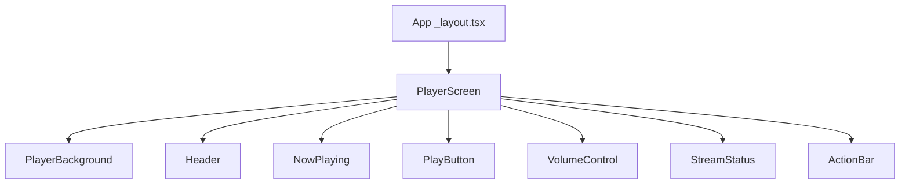
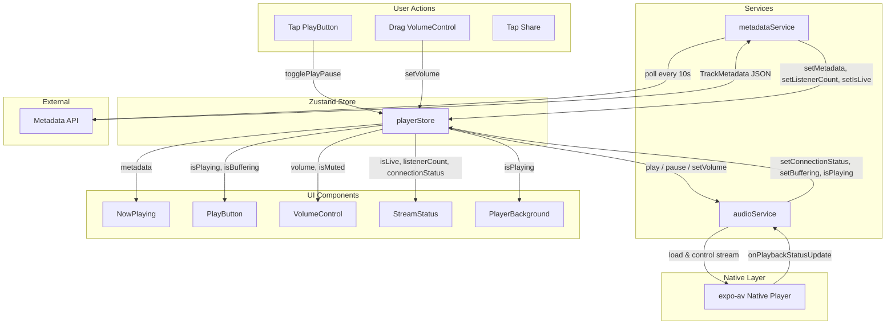

# BonnyTone Radio -- Component Structure

> Single-screen radio player app with glass-morphism design.
> Built with React Native (Expo Router), Zustand, and expo-av.

---

## 1. Component Tree

```
App (expo-router _layout.tsx)
└── PlayerScreen
    ├── PlayerBackground
    ├── Header
    ├── NowPlaying
    │   ├── Artwork (internal)
    │   ├── Title (internal)
    │   └── Artist (internal)
    ├── PlayButton
    ├── VolumeControl
    │   ├── MuteToggle (internal)
    │   └── Slider (internal)
    ├── StreamStatus
    └── ActionBar
        ├── ShareButton (internal)
        ├── QualityButton (internal)
        └── MoreButton (internal)
```



---

## 2. File Structure

```
app/
  _layout.tsx              # Root layout (expo-router)
  index.tsx                # PlayerScreen entry

screens/
  PlayerScreen.tsx         # Main (and only) screen

components/
  PlayerBackground.tsx     # Animated gradient background
  PlayButton.tsx           # Large circular glass play/pause button
  NowPlaying.tsx           # Artwork + artist + title display
  VolumeControl.tsx        # Horizontal volume slider + mute toggle
  ActionBar.tsx            # Share, quality, more buttons
  StreamStatus.tsx         # LIVE badge, listener count, status text
  Header.tsx               # App logo, glass overlay bar

services/
  audioService.ts          # expo-av audio management
  metadataService.ts       # Now-playing API polling

store/
  playerStore.ts           # Zustand store

hooks/
  usePlayer.ts             # Player actions hook
  useNowPlaying.ts         # Metadata polling hook

types/
  player.ts                # TypeScript interfaces

constants/
  theme.ts                 # Colors, typography, spacing
  config.ts                # Stream URL, API URL, intervals
```

---

## 3. Component Documentation

### 3.1 `app/_layout.tsx` -- Root Layout

**Purpose:** Expo Router root layout. Wraps the app in required providers (StatusBar config, SafeAreaProvider). Sets the status bar to light content for the dark background.

**Props:** None (Expo Router slot).

**Local state:** None.

**Store slices:** None.

**Children:** Renders `<Slot />` which resolves to `index.tsx`.

```tsx
// app/_layout.tsx
import { Slot } from "expo-router";
import { StatusBar } from "expo-status-bar";
import { SafeAreaProvider } from "react-native-safe-area-context";

export default function RootLayout() {
  return (
    <SafeAreaProvider>
      <StatusBar style="light" />
      <Slot />
    </SafeAreaProvider>
  );
}
```

---

### 3.2 `app/index.tsx` -- Entry Point

**Purpose:** Maps the root route (`/`) to `PlayerScreen`. Thin redirect or re-export.

**Props:** None.

**Local state:** None.

**Store slices:** None.

**Children:** `<PlayerScreen />`

---

### 3.3 `screens/PlayerScreen.tsx` -- Main Screen

**Purpose:** The single screen of the app. Composes all player UI components in a vertical layout. Initializes the audio service and metadata polling on mount via hooks.

**Props interface:**

```tsx
// No external props -- this is the root screen component.
```

**Local state:** None. All state lives in Zustand.

**Store slices consumed:**
- None directly. Delegates to child components and hooks.

**Hooks used:**
- `usePlayer()` -- initializes audio service, exposes play/pause/volume actions.
- `useNowPlaying()` -- starts metadata polling on mount.

**Children:**
- `PlayerBackground`
- `Header`
- `NowPlaying`
- `PlayButton`
- `VolumeControl`
- `StreamStatus`
- `ActionBar`

---

### 3.4 `components/PlayerBackground.tsx` -- Animated Gradient Background

**Purpose:** Full-screen animated gradient that fills the background. Shifts subtly based on playback state to give visual feedback. Uses `expo-linear-gradient` with Reanimated for smooth transitions.

**Props interface:**

```tsx
interface PlayerBackgroundProps {
  /** Whether the stream is currently playing. Drives animation intensity. */
  isPlaying: boolean;
}
```

**Local state:**
- Reanimated shared values for gradient stop positions and opacity.

**Store slices consumed:**
- `playerStore.isPlaying` (passed as prop from PlayerScreen).

**Children:** None (leaf component).

---

### 3.5 `components/Header.tsx` -- App Logo Bar

**Purpose:** Top bar with the BonnyTone Radio logo/wordmark. Rendered as a glass-morphism overlay bar pinned to the top safe area.

**Props interface:**

```tsx
interface HeaderProps {
  /** Optional subtitle or tagline text. */
  subtitle?: string;
}
```

**Local state:** None.

**Store slices consumed:** None.

**Children:** None (leaf component).

---

### 3.6 `components/NowPlaying.tsx` -- Now-Playing Display

**Purpose:** Displays the current track artwork, artist name, and track title. Artwork fades/crossfades when the track changes.

**Props interface:**

```tsx
interface NowPlayingProps {
  artworkUrl: string | null;
  title: string;
  artist: string;
}
```

**Local state:**
- `previousArtworkUrl` -- used to drive crossfade animation between artwork images.

**Store slices consumed:**
- `playerStore.metadata.title`
- `playerStore.metadata.artist`
- `playerStore.metadata.artworkUrl`

(Consumed via props passed from PlayerScreen, or read directly with a selector.)

**Children:** Internal sub-elements (Image, Text) -- no exported child components.

---

### 3.7 `components/PlayButton.tsx` -- Play/Pause Control

**Purpose:** Large circular glass-morphism button in the center of the screen. Toggles between play and pause states. Includes a press animation (scale down + haptic feedback).

**Props interface:**

```tsx
interface PlayButtonProps {
  isPlaying: boolean;
  isBuffering: boolean;
  onPress: () => void;
}
```

**Local state:**
- Reanimated shared value for press scale animation.

**Store slices consumed:**
- `playerStore.isPlaying` (via prop)
- `playerStore.isBuffering` (via prop)

**Children:** None (renders an icon internally -- play triangle or pause bars, plus an optional ActivityIndicator when buffering).

---

### 3.8 `components/VolumeControl.tsx` -- Volume Slider

**Purpose:** Horizontal slider for volume control with a mute/unmute toggle icon on the left. Slider track uses a glass-morphism fill.

**Props interface:**

```tsx
interface VolumeControlProps {
  volume: number;           // 0..1
  isMuted: boolean;
  onVolumeChange: (value: number) => void;
  onMuteToggle: () => void;
}
```

**Local state:** None. Volume is fully controlled via props/store.

**Store slices consumed:**
- `playerStore.volume` (via prop)
- `playerStore.isMuted` (via prop)

**Children:** Internal `MuteToggle` (Pressable icon) and `Slider` (React Native Slider or custom).

---

### 3.9 `components/StreamStatus.tsx` -- Stream Status Indicator

**Purpose:** Displays a LIVE badge (pulsing red dot), current listener count, and a textual connection status (e.g., "Connected", "Reconnecting...").

**Props interface:**

```tsx
interface StreamStatusProps {
  isLive: boolean;
  listenerCount: number | null;
  connectionStatus: ConnectionStatus; // "connected" | "connecting" | "disconnected" | "error"
}
```

**Local state:**
- Reanimated shared value for the LIVE dot pulse animation.

**Store slices consumed:**
- `playerStore.isLive`
- `playerStore.listenerCount`
- `playerStore.connectionStatus`

**Children:** None (leaf component).

---

### 3.10 `components/ActionBar.tsx` -- Bottom Action Buttons

**Purpose:** Row of secondary action buttons: Share (native share sheet), Quality selector (stream bitrate), and More (overflow menu). Each button uses a small glass-morphism pill style.

**Props interface:**

```tsx
interface ActionBarProps {
  onShare: () => void;
  onQualityPress: () => void;
  onMorePress: () => void;
  currentQuality: StreamQuality; // "low" | "medium" | "high"
}
```

**Local state:** None.

**Store slices consumed:**
- `playerStore.streamQuality` (via prop)

**Children:** Internal `ShareButton`, `QualityButton`, `MoreButton` (Pressable elements, not exported).

---

### 3.11 `services/audioService.ts` -- Audio Management

**Purpose:** Wraps `expo-av` Audio API. Manages loading, playing, pausing, and unloading the audio stream. Handles background audio configuration, interruption events, and reconnection logic.

**Exports:**

```tsx
interface AudioService {
  initialize(): Promise<void>;
  play(streamUrl: string): Promise<void>;
  pause(): Promise<void>;
  setVolume(volume: number): Promise<void>;
  destroy(): Promise<void>;
}

// Singleton instance
export const audioService: AudioService;
```

**Store interaction:** Dispatches status updates to `playerStore` (isPlaying, isBuffering, connectionStatus) via store actions called from playback status callbacks.

---

### 3.12 `services/metadataService.ts` -- Metadata Polling

**Purpose:** Polls the now-playing metadata API at a configured interval. Parses the response and pushes track info (title, artist, artwork URL, listener count) into the Zustand store.

**Exports:**

```tsx
interface MetadataService {
  startPolling(): void;
  stopPolling(): void;
  fetchNow(): Promise<TrackMetadata>;
}

export const metadataService: MetadataService;
```

**Store interaction:** Calls `playerStore.getState().setMetadata(...)` on each successful poll.

---

### 3.13 `store/playerStore.ts` -- Zustand Store

**Purpose:** Single Zustand store holding all player state. Flat structure, no nested slices.

```tsx
interface PlayerState {
  // Playback
  isPlaying: boolean;
  isBuffering: boolean;
  volume: number;
  isMuted: boolean;
  connectionStatus: ConnectionStatus;

  // Metadata
  metadata: TrackMetadata;
  isLive: boolean;
  listenerCount: number | null;

  // Settings
  streamQuality: StreamQuality;

  // Actions
  play: () => Promise<void>;
  pause: () => Promise<void>;
  togglePlayPause: () => Promise<void>;
  setVolume: (volume: number) => void;
  toggleMute: () => void;
  setMetadata: (metadata: TrackMetadata) => void;
  setConnectionStatus: (status: ConnectionStatus) => void;
  setStreamQuality: (quality: StreamQuality) => void;
  setBuffering: (isBuffering: boolean) => void;
  setIsLive: (isLive: boolean) => void;
  setListenerCount: (count: number | null) => void;
}
```

---

### 3.14 `hooks/usePlayer.ts` -- Player Actions Hook

**Purpose:** Convenience hook that initializes the audio service on mount and returns bound player actions. Handles cleanup (destroy) on unmount.

```tsx
function usePlayer(): {
  isPlaying: boolean;
  isBuffering: boolean;
  volume: number;
  isMuted: boolean;
  togglePlayPause: () => Promise<void>;
  setVolume: (v: number) => void;
  toggleMute: () => void;
};
```

**Store slices consumed:** `isPlaying`, `isBuffering`, `volume`, `isMuted`, and all action functions.

---

### 3.15 `hooks/useNowPlaying.ts` -- Metadata Polling Hook

**Purpose:** Starts metadata polling on mount, stops on unmount. Returns current track metadata for display.

```tsx
function useNowPlaying(): {
  title: string;
  artist: string;
  artworkUrl: string | null;
  isLive: boolean;
  listenerCount: number | null;
};
```

**Store slices consumed:** `metadata`, `isLive`, `listenerCount`.

---

### 3.16 `types/player.ts` -- TypeScript Interfaces

```tsx
type ConnectionStatus = "connected" | "connecting" | "disconnected" | "error";

type StreamQuality = "low" | "medium" | "high";

interface TrackMetadata {
  title: string;
  artist: string;
  artworkUrl: string | null;
}
```

---

### 3.17 `constants/theme.ts` -- Design Tokens

See Section 5 for full token definitions.

### 3.18 `constants/config.ts` -- Runtime Configuration

```tsx
export const CONFIG = {
  STREAM_URL: "https://stream.bonnytone.com/live",
  METADATA_API_URL: "https://api.bonnytone.com/now-playing",
  METADATA_POLL_INTERVAL_MS: 10_000,
  RECONNECT_DELAY_MS: 3_000,
  MAX_RECONNECT_ATTEMPTS: 5,
};
```

---

## 4. Data Flow Diagram



### Flow Summary

1. **User actions to audio:** User taps PlayButton -> `playerStore.togglePlayPause()` -> `audioService.play()` -> `expo-av` native player loads and plays the stream.

2. **Metadata API to UI:** `metadataService` polls the now-playing endpoint every 10 seconds -> parses the response -> calls `playerStore.setMetadata()` -> `NowPlaying` component re-renders with new title, artist, and artwork.

3. **Audio events to UI:** Native player emits `onPlaybackStatusUpdate` -> `audioService` interprets the status (buffering, playing, error) -> updates `playerStore` (connectionStatus, isBuffering, isPlaying) -> `PlayButton`, `StreamStatus`, and `PlayerBackground` re-render accordingly.

---

## 5. Design Tokens

All tokens are defined in `constants/theme.ts`.

### Colors

| Token | Value | Usage |
|-------|-------|-------|
| `colors.primary` | `#06b6d4` (Cyan 500) | Active controls, focused states, slider fill |
| `colors.primaryAlt` | `#14b8a6` (Teal 500) | Gradient accent, secondary highlights |
| `colors.backgroundStart` | `#0a0a0a` | Gradient start (top) |
| `colors.backgroundEnd` | `#1a1a1a` | Gradient end (bottom) |
| `colors.glass` | `rgba(255, 255, 255, 0.05)` | Glass-morphism surface fill |
| `colors.glassBorder` | `rgba(255, 255, 255, 0.1)` | Glass-morphism border |
| `colors.text` | `#ffffff` | Primary text |
| `colors.textSecondary` | `rgba(255, 255, 255, 0.6)` | Secondary/metadata text |
| `colors.textTertiary` | `rgba(255, 255, 255, 0.4)` | Tertiary/hint text |
| `colors.liveBadge` | `#ef4444` (Red 500) | LIVE indicator dot and badge |

### Glass-Morphism

```tsx
export const glass = {
  background: "rgba(255, 255, 255, 0.05)",
  borderColor: "rgba(255, 255, 255, 0.1)",
  borderWidth: 1,
  backdropBlur: 20, // applied via expo-blur BlurView intensity
  borderRadius: 16,
};
```

### Typography

| Token | Font | Weight | Size | Usage |
|-------|------|--------|------|-------|
| `typography.heading` | System | Bold (700) | 28pt | App title, track title |
| `typography.headingLg` | System | Bold (700) | 32pt | Hero/splash text |
| `typography.body` | System | Regular (400) | 16pt | Body text, descriptions |
| `typography.metadata` | System | Medium (500) | 14pt | Artist name, status text |
| `typography.caption` | System | Regular (400) | 12pt | Listener count, badges |

### Spacing

```tsx
export const spacing = {
  xs: 4,
  sm: 8,
  md: 16,
  lg: 24,
  xl: 32,
  xxl: 48,
};
```

### Sizing

| Token | Value | Usage |
|-------|-------|-------|
| `sizes.playButton` | 80 | PlayButton diameter |
| `sizes.playButtonIcon` | 32 | Play/pause icon inside button |
| `sizes.artwork` | 240 | NowPlaying artwork square |
| `sizes.artworkRadius` | 16 | Artwork border radius |
| `sizes.actionButton` | 44 | ActionBar button hit area |

---

## Document Completion Checklist

- [x] All required sections present
- [x] Code examples included (where applicable)
- [x] Spec sections referenced
- [x] Mobile-first considerations addressed
- [x] TypeScript types used in examples
- [x] Acceptance criteria defined (where applicable)
- [x] Ready for Team Lead review

**Author:** Architect Agent
**Date:** 2026-03-10
**Status:** Ready for Review
