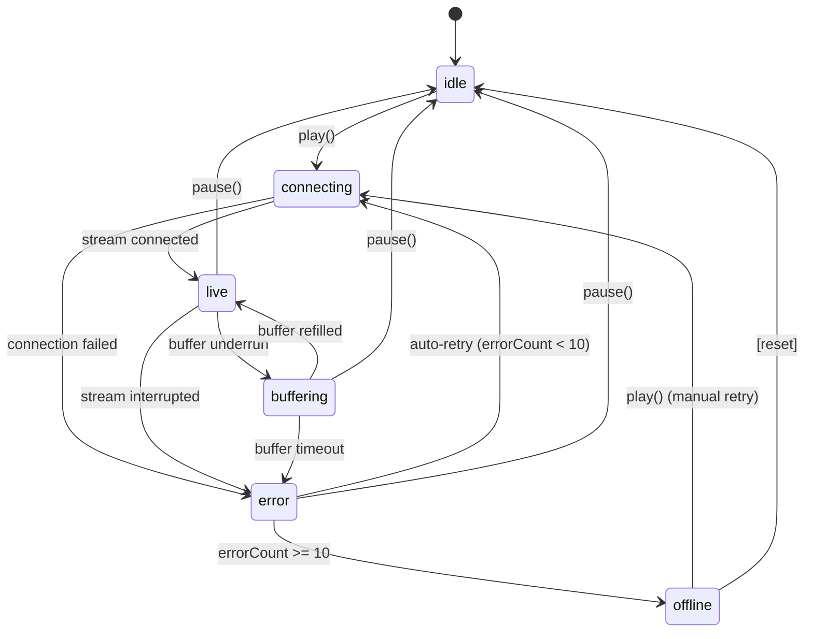

# State Management Architecture

> BonnyTone Radio Mobile App -- Zustand Player Store Implementation Guide
>
> **Spec Reference:** Section 6 (State Management Architecture)

---

## Table of Contents

1. [Store Structure](#1-store-structure)
2. [Complete Store Implementation](#2-complete-store-implementation)
3. [Persistence Strategy](#3-persistence-strategy)
4. [State Update Patterns](#4-state-update-patterns)
5. [State Machine Implementation](#5-state-machine-implementation)
6. [Error State Management](#6-error-state-management)
7. [Hook Usage Examples](#7-hook-usage-examples)

---

## 1. Store Structure

The player store is the single source of truth for all audio playback state. Every UI component and service reads from and writes to this store.

### TypeScript Interfaces

```typescript
export type Quality = 'auto' | 'low' | 'medium' | 'high'
export type StreamStatus = 'idle' | 'connecting' | 'live' | 'offline' | 'error'

export interface NowPlayingInfo {
  title: string
  artist: string
  art: string | null
}

export interface PlayerState {
  // Playback state
  isPlaying: boolean
  isBuffering: boolean
  volume: number              // 0-1
  isMuted: boolean
  previousVolume: number
  quality: Quality
  streamStatus: StreamStatus

  // Metadata
  listenerCount: number | null
  nowPlaying: NowPlayingInfo | null
  currentBitrate: number | null

  // Error tracking
  errorCount: number
  lastError: string | null

  // Actions -- playback
  play: () => void
  pause: () => void
  togglePlay: () => void
  setVolume: (volume: number) => void
  toggleMute: () => void
  setQuality: (quality: Quality) => void

  // Actions -- state setters
  setIsPlaying: (isPlaying: boolean) => void
  setIsBuffering: (isBuffering: boolean) => void
  setStreamStatus: (status: StreamStatus) => void
  setListenerCount: (count: number | null) => void
  setNowPlaying: (info: NowPlayingInfo | null) => void
  setCurrentBitrate: (bitrate: number | null) => void

  // Actions -- error management
  setError: (error: string | null) => void
  incrementErrorCount: () => void
  resetErrorCount: () => void

  // Actions -- persistence
  hydrateVolume: () => void
}
```

### Design Decisions

- **Flat state shape.** No nested objects beyond `nowPlaying`. This keeps selectors simple and avoids deep-equality problems.
- **Actions co-located with state.** Zustand stores actions alongside data in a single `create` call, eliminating the need for separate action creators or dispatchers.
- **`previousVolume` for mute/unmute.** Storing the volume before mute allows a clean restore without re-reading persisted storage.

---

## 2. Complete Store Implementation

File: `src/store/playerStore.ts`

```typescript
import { create } from 'zustand'
import AsyncStorage from '@react-native-async-storage/async-storage'
import { audioService } from '@/services/audioService'
import type { PlayerState, Quality, StreamStatus, NowPlayingInfo } from './types'

const VOLUME_STORAGE_KEY = '@bonnytone/volume'
const MAX_ERROR_COUNT = 10

export const usePlayerStore = create<PlayerState>((set, get) => ({
  // ── Initial state ────────────────────────────────────────────────
  isPlaying: false,
  isBuffering: false,
  volume: 0.8,
  isMuted: false,
  previousVolume: 0.8,
  quality: 'auto',
  streamStatus: 'idle',
  listenerCount: null,
  nowPlaying: null,
  currentBitrate: null,
  errorCount: 0,
  lastError: null,

  // ── Playback actions ─────────────────────────────────────────────

  play: () => {
    set({ streamStatus: 'connecting', lastError: null })
    audioService.play()
    // audioService is responsible for calling setIsPlaying(true) and
    // setStreamStatus('live') once the stream is actually connected.
  },

  pause: () => {
    audioService.pause()
    set({ isPlaying: false, isBuffering: false })
  },

  togglePlay: () => {
    const { isPlaying, play, pause } = get()
    if (isPlaying) {
      pause()
    } else {
      play()
    }
  },

  setVolume: (volume: number) => {
    const clamped = Math.min(1, Math.max(0, volume))
    set({ volume: clamped, isMuted: clamped === 0 })
    audioService.setVolume(clamped)

    // Persist asynchronously -- fire and forget
    AsyncStorage.setItem(VOLUME_STORAGE_KEY, String(clamped)).catch(() => {
      // Persistence failure is non-critical; swallow the error.
    })
  },

  toggleMute: () => {
    const { isMuted, volume, previousVolume } = get()
    if (isMuted) {
      // Restore previous volume
      set({ isMuted: false, volume: previousVolume })
      audioService.setVolume(previousVolume)
    } else {
      // Save current volume before muting
      set({ isMuted: true, previousVolume: volume, volume: 0 })
      audioService.setVolume(0)
    }
  },

  setQuality: (quality: Quality) => {
    set({ quality })
    // If currently playing, the audio service will pick up the new
    // quality on the next reconnect or can be notified directly.
    if (get().isPlaying) {
      audioService.setQuality(quality)
    }
  },

  // ── State setters (called by audioService) ───────────────────────

  setIsPlaying: (isPlaying: boolean) => set({ isPlaying }),

  setIsBuffering: (isBuffering: boolean) => set({ isBuffering }),

  setStreamStatus: (status: StreamStatus) => set({ streamStatus: status }),

  setListenerCount: (count: number | null) => set({ listenerCount: count }),

  setNowPlaying: (info: NowPlayingInfo | null) => set({ nowPlaying: info }),

  setCurrentBitrate: (bitrate: number | null) => set({ currentBitrate: bitrate }),

  // ── Error management ─────────────────────────────────────────────

  setError: (error: string | null) => {
    set({ lastError: error })
    if (error !== null) {
      set({ streamStatus: 'error' })
    }
  },

  incrementErrorCount: () => {
    const next = get().errorCount + 1
    set({ errorCount: next })
    if (next >= MAX_ERROR_COUNT) {
      set({ streamStatus: 'offline', isPlaying: false, isBuffering: false })
    }
  },

  resetErrorCount: () => set({ errorCount: 0 }),

  // ── Persistence ──────────────────────────────────────────────────

  hydrateVolume: async () => {
    try {
      const stored = await AsyncStorage.getItem(VOLUME_STORAGE_KEY)
      if (stored !== null) {
        const parsed = parseFloat(stored)
        if (!isNaN(parsed) && parsed >= 0 && parsed <= 1) {
          set({ volume: parsed, previousVolume: parsed })
        }
      }
    } catch {
      // Fall back to default volume silently.
    }
  },
}))
```

---

## 3. Persistence Strategy

Only the **volume** value is persisted to `AsyncStorage`. All other state is transient and derived from the live audio stream on each session.

### Why Only Volume?

| State field     | Persist? | Reason                                                   |
|-----------------|----------|----------------------------------------------------------|
| `volume`        | Yes      | User preference that should survive app restarts         |
| `isPlaying`     | No       | Stream must be re-established each launch                |
| `streamStatus`  | No       | Derived from live connection state                       |
| `nowPlaying`    | No       | Changes every few minutes; stale data is worse than none |
| `quality`       | No       | Could be persisted in future; keeping simple for v1      |

### Save on Change

Volume is written to `AsyncStorage` inside `setVolume()` every time it changes. The write is fire-and-forget to avoid blocking the UI thread.

```typescript
// Inside setVolume action
AsyncStorage.setItem(VOLUME_STORAGE_KEY, String(clamped)).catch(() => {
  // Non-critical -- default volume (0.8) is acceptable fallback.
})
```

### Load on Launch

`hydrateVolume()` is called once during app initialization, before the player UI mounts.

```typescript
// App.tsx or root layout
import { usePlayerStore } from '@/store/playerStore'
import { useEffect } from 'react'

export default function RootLayout({ children }: { children: React.ReactNode }) {
  useEffect(() => {
    usePlayerStore.getState().hydrateVolume()
  }, [])

  return <>{children}</>
}
```

The call uses `getState()` rather than a hook selector because hydration is a one-time side effect, not a reactive subscription.

---

## 4. State Update Patterns

### Pattern A: Audio Service Updates the Store

The `audioService` is a plain TypeScript module (not a React component). It accesses the store imperatively through `getState()`.

```typescript
// Inside audioService.ts
import { usePlayerStore } from '@/store/playerStore'

function onStreamConnected() {
  const store = usePlayerStore.getState()
  store.setIsPlaying(true)
  store.setIsBuffering(false)
  store.setStreamStatus('live')
  store.resetErrorCount()
}

function onStreamError(message: string) {
  const store = usePlayerStore.getState()
  store.setError(message)
  store.incrementErrorCount()
  store.setIsBuffering(false)
}

function onMetadataUpdate(title: string, artist: string, art: string | null) {
  usePlayerStore.getState().setNowPlaying({ title, artist, art })
}

function onListenerCountUpdate(count: number) {
  usePlayerStore.getState().setListenerCount(count)
}
```

This pattern keeps the audio service decoupled from React while still allowing it to drive UI updates through the shared store.

### Pattern B: UI Components Consume the Store

React components subscribe to the store using **selector hooks**. Each component selects only the slice of state it needs, which prevents unnecessary re-renders when unrelated state changes.

```typescript
// PlayerButton.tsx -- only re-renders when isPlaying or isBuffering changes
const isPlaying = usePlayerStore(state => state.isPlaying)
const isBuffering = usePlayerStore(state => state.isBuffering)
const togglePlay = usePlayerStore(state => state.togglePlay)
```

### Selector Best Practices

**Select primitives individually** rather than returning objects, unless you provide a custom equality function.

```typescript
// Good -- primitive selectors, referential stability guaranteed
const volume = usePlayerStore(state => state.volume)
const isMuted = usePlayerStore(state => state.isMuted)

// Bad -- creates a new object every render, always triggers re-render
const { volume, isMuted } = usePlayerStore(state => ({
  volume: state.volume,
  isMuted: state.isMuted,
}))
```

When you do need multiple values in a single selector, use Zustand's `shallow` comparator:

```typescript
import { shallow } from 'zustand/shallow'

// Good -- shallow comparison prevents unnecessary re-renders
const { volume, isMuted } = usePlayerStore(
  state => ({ volume: state.volume, isMuted: state.isMuted }),
  shallow
)
```

### Action Selectors

Actions are stable references (they never change between renders), so grouping them in an object selector is safe without `shallow`:

```typescript
// Safe -- action references are stable
const { play, pause, toggleMute } = usePlayerStore(state => ({
  play: state.play,
  pause: state.pause,
  toggleMute: state.toggleMute,
}))
```

---

## 5. State Machine Implementation

The `streamStatus` field acts as a finite state machine governing the player lifecycle.

### State Diagram



### Transition Table

| From         | To           | Trigger                                    | Action                               |
|--------------|--------------|---------------------------------------------|--------------------------------------|
| `idle`       | `connecting` | User taps play                              | `play()`                             |
| `connecting` | `live`       | Audio service confirms stream               | `setStreamStatus('live')`            |
| `connecting` | `error`      | Connection timeout or failure               | `setError(msg)`                      |
| `live`       | `idle`       | User taps pause                             | `pause()`                            |
| `live`       | `buffering`  | Audio buffer underrun detected              | `setIsBuffering(true)`               |
| `live`       | `error`      | Stream drops unexpectedly                   | `setError(msg)`                      |
| `buffering`  | `live`       | Buffer refilled, playback resumes           | `setIsBuffering(false)`              |
| `buffering`  | `error`      | Buffer timeout exceeded                     | `setError(msg)`                      |
| `error`      | `connecting` | Auto-retry when `errorCount < 10`           | `play()`                             |
| `error`      | `offline`    | `errorCount` reaches 10                     | `incrementErrorCount()`              |
| `offline`    | `connecting` | User manually taps play after offline state | `play()` (also resets error count)   |

### Transition Logic in Actions

The state machine transitions are distributed across the store actions and the audio service callbacks. The store itself does not enforce valid transitions -- it trusts the audio service to call the right setters in the right order. This keeps the store simple while the audio service owns the connection lifecycle.

```typescript
// Simplified flow:
// 1. User taps play
//    store: streamStatus = 'connecting'
//    audioService.play() called
//
// 2. Audio service connects successfully
//    store: isPlaying = true, streamStatus = 'live', errorCount = 0
//
// 3. Stream drops
//    store: lastError = '...', streamStatus = 'error', errorCount++
//
// 4. Auto-retry (if errorCount < 10)
//    store: streamStatus = 'connecting'
//    audioService.play() called again
//
// 5. After 10 failures
//    store: streamStatus = 'offline', isPlaying = false
//    User must manually tap play to retry
```

---

## 6. Error State Management

Error handling follows a **counted-retry-then-stop** pattern. The audio service retries automatically on transient failures, but gives up after a configurable threshold to avoid draining battery on a dead stream.

### `incrementErrorCount()`

Called by the audio service each time a connection attempt or stream playback fails.

```typescript
incrementErrorCount: () => {
  const next = get().errorCount + 1
  set({ errorCount: next })
  if (next >= MAX_ERROR_COUNT) {
    // Too many consecutive failures -- stop retrying
    set({ streamStatus: 'offline', isPlaying: false, isBuffering: false })
  }
},
```

When `errorCount` reaches `MAX_ERROR_COUNT` (10), the store transitions to `offline`. In this state, no automatic retries occur. The UI should display a message indicating the stream is unavailable and offer a manual retry button.

### `resetErrorCount()`

Called by the audio service when playback succeeds (stream transitions to `live`). This resets the counter so that future transient errors get a fresh retry budget.

```typescript
resetErrorCount: () => set({ errorCount: 0 }),
```

### `setError()`

Stores the most recent error message for display in the UI. Setting a non-null error also transitions `streamStatus` to `error`.

```typescript
setError: (error: string | null) => {
  set({ lastError: error })
  if (error !== null) {
    set({ streamStatus: 'error' })
  }
},
```

### UI Error Display

```typescript
// ErrorBanner.tsx
function ErrorBanner() {
  const streamStatus = usePlayerStore(state => state.streamStatus)
  const lastError = usePlayerStore(state => state.lastError)
  const errorCount = usePlayerStore(state => state.errorCount)
  const play = usePlayerStore(state => state.play)

  if (streamStatus === 'offline') {
    return (
      <Banner variant="error">
        <Text>Stream unavailable. Check your connection.</Text>
        <Button onPress={play}>Retry</Button>
      </Banner>
    )
  }

  if (streamStatus === 'error' && lastError) {
    return (
      <Banner variant="warning">
        <Text>Reconnecting... ({errorCount}/10)</Text>
      </Banner>
    )
  }

  return null
}
```

---

## 7. Hook Usage Examples

### Basic Playback Controls

```typescript
import { usePlayerStore } from '@/store/playerStore'

function PlayPauseButton() {
  const isPlaying = usePlayerStore(state => state.isPlaying)
  const isBuffering = usePlayerStore(state => state.isBuffering)
  const togglePlay = usePlayerStore(state => state.togglePlay)

  return (
    <TouchableOpacity onPress={togglePlay} disabled={isBuffering}>
      {isBuffering ? <Spinner /> : isPlaying ? <PauseIcon /> : <PlayIcon />}
    </TouchableOpacity>
  )
}
```

### Volume Slider

```typescript
function VolumeSlider() {
  const volume = usePlayerStore(state => state.volume)
  const setVolume = usePlayerStore(state => state.setVolume)
  const toggleMute = usePlayerStore(state => state.toggleMute)
  const isMuted = usePlayerStore(state => state.isMuted)

  return (
    <View style={styles.row}>
      <TouchableOpacity onPress={toggleMute}>
        {isMuted ? <MutedIcon /> : <VolumeIcon />}
      </TouchableOpacity>
      <Slider
        value={volume}
        onValueChange={setVolume}
        minimumValue={0}
        maximumValue={1}
        step={0.01}
      />
    </View>
  )
}
```

### Now Playing Display

```typescript
function NowPlaying() {
  const nowPlaying = usePlayerStore(state => state.nowPlaying)

  if (!nowPlaying) return null

  return (
    <View style={styles.nowPlaying}>
      {nowPlaying.art && (
        <Image source={{ uri: nowPlaying.art }} style={styles.art} />
      )}
      <View>
        <Text style={styles.title}>{nowPlaying.title}</Text>
        <Text style={styles.artist}>{nowPlaying.artist}</Text>
      </View>
    </View>
  )
}
```

### Stream Status Indicator

```typescript
function StatusBadge() {
  const streamStatus = usePlayerStore(state => state.streamStatus)

  const config: Record<string, { label: string; color: string }> = {
    idle: { label: 'Ready', color: '#888' },
    connecting: { label: 'Connecting...', color: '#f59e0b' },
    live: { label: 'LIVE', color: '#22c55e' },
    offline: { label: 'Offline', color: '#ef4444' },
    error: { label: 'Reconnecting', color: '#f59e0b' },
  }

  const { label, color } = config[streamStatus] ?? config.idle

  return <Badge label={label} color={color} />
}
```

### Listener Count (Conditional Rendering)

```typescript
function ListenerCount() {
  const listenerCount = usePlayerStore(state => state.listenerCount)

  if (listenerCount === null) return null

  return (
    <Text style={styles.listeners}>
      {listenerCount.toLocaleString()} listening
    </Text>
  )
}
```

### Selecting Multiple Values with Shallow Comparison

```typescript
import { shallow } from 'zustand/shallow'

function PlayerHeader() {
  const { title, artist, streamStatus, listenerCount } = usePlayerStore(
    state => ({
      title: state.nowPlaying?.title ?? 'BonnyTone Radio',
      artist: state.nowPlaying?.artist ?? '',
      streamStatus: state.streamStatus,
      listenerCount: state.listenerCount,
    }),
    shallow
  )

  return (
    <View>
      <Text>{title}</Text>
      <Text>{artist}</Text>
      <StatusBadge status={streamStatus} />
      {listenerCount !== null && <Text>{listenerCount} listening</Text>}
    </View>
  )
}
```

---

## Mobile-First Considerations

- **Battery.** The counted-retry pattern (`MAX_ERROR_COUNT = 10`) prevents infinite reconnection loops that would drain the battery when the stream is genuinely unavailable.
- **Memory.** Flat state shape and primitive selectors minimize the number of React component re-renders, keeping memory allocation low.
- **Background playback.** When the app enters the background, `isPlaying` remains true and the audio service continues independently. The store is still updated via `getState()` calls from the audio service, so the UI is current when the user returns.
- **AsyncStorage.** Only one key is persisted (`@bonnytone/volume`). Reads and writes are asynchronous and non-blocking, ensuring no jank on the main thread.

---

## Document Completion Checklist

- [x] All required sections present
- [x] Code examples included (where applicable)
- [x] Spec sections referenced
- [x] Mobile-first considerations addressed
- [x] TypeScript types used in examples
- [x] Acceptance criteria defined (where applicable)
- [x] Ready for Team Lead review

**Author:** Architect Agent
**Date:** 2026-03-10
**Status:** Ready for Review
